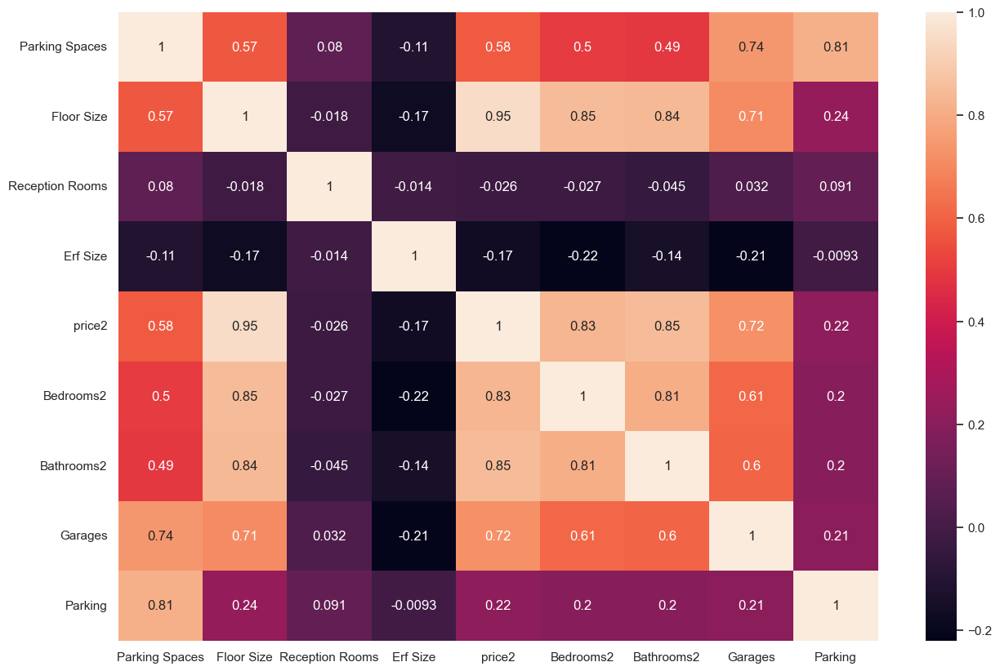

# Property-Price-Prediction-Sandown-Cape-Town

This repo contains an end-to-end project on predicting property prices in the Sandown area in Blouberg, Western Cape, South Africa.

This project starts with data scraping from the website containing listings of properties - houses, apartments and townhouses. 
# EDA
The original dataset had 346 attributes, but after data cleaning, we reduced it to 10 important attributes, namely, Floor Size (in m²), Garden (Yes/No), Type of Property (House/Apartment/Townhouse), Pets Allowed (Yes/No), Reception Rooms (Count), Pool (Yes or No), price2 (House prices in thousands of Rands)', Bedrooms2 (Count), Bathrooms2(Count) and Parking (Count).

There are ~24k listings scraped but we are focused on the 565 properties listed in Sandown area, Blouberg, Western Cape, South Africa.

## Distribution of Prices
The summary starts is shown below. Since the median and the mean are almost equal, we will treat the distribution of prices as 'not skewed'.

There are also no outliers shown in the boxplot.

{\
 'min': np.float64(719.9),\
 'max': np.float64(6500.0),\
 'mean': np.float64(3134.4),\
 'median': np.float64(3149.0),\
 '25th percentile': np.float64(2131.5),\
 '75th percentile': np.float64(3995.0),\
 'IQR': np.float64(1863.5),\
 'range': np.float64(5780.1)\
 }

## Distribution of Days Since Listing
This attribute analyzes the number of days since the day of listing to the current date (day of this analysis).

The latest listing was done 2 days ago based on min, and the oldest one was done slightly more than 2 years ago shown by the mix. There are also upper outliers being listings greater than median + 1.5*IQR.

{\
'min': np.int64(2),\
 'max': np.int64(798),\
 'mean': np.float64(124.68318584070796),\
 'median': np.float64(84.0),\
 '25th percentile': np.float64(39.0),\
 '75th percentile': np.float64(162.0),\
 'IQR': np.float64(123.0),\
 'range': np.int64(796)\
 }

## Correlation Check
There's a very strong correlation between price and Floor Size (0.95), Bathrooms (0.85) and Bedrooms (0.83). There's is also a medium to strond correlation with No of Garages (0.72) and Parking Spaces (0.58)

More EDA Analysis is done on the [notebook](modelling.ipynb).

# Modelling
We used the following models to predict property prices:

- LinearRegression, Polynomial Regression (Degree=2)
- Regularization models (Lasso and Ridge)
- Decision Tree Regressor
- Ensemble methods (Random Forest, Adaboost and XGBoost)

We then evaluated the models using R^2, Mean Absolute Error (MAE), Mean Squared Error (MSE) and Root MSE (RMSE), and obtained the following results for each evaluation metric.

Recall: 
- 'mean of prices': np.float64(3134.4),
- 'median of prices': np.float64(3149.0),

## R^2 - Coefficient of Determination
- All models except Polynomial Regressor achieved greater than 0.9. That means, more than 90% of the variance in the price data is explained by each of those models. 
- This is an excellent score, as a value close to 1 indicates a very good fit. *Top 2 models by R^2 is XGBoost with 0.946 and Random Forest Regressor at 0.946*.

## MAE - Mean Absolute Error
- MAE explains the mean difference between actual and predicted values. The lower the value the better the model. The best 2 models by MAE are Decision Trees and Random Forest with MAE=158.5 and MAE=158.7. 
- That means, the average error in predictions is ~159 thousands, which is roughly 5% of the mean price. Another way to look at it is to say that, our model is 159 thousands off in predictions, on average. Given that this figure is relatively small compared to the mean price, we can consider the top models to be good fit for the data based on MAE.

## MSE - Mean Squared Error and RMSE - Root MSE

- MSE is the average squared difference between predicted and actual values. Since it squares the differences, it penalizes large errors more than the small ones. 
- RMSE is the square root of MSE. Let's use the RMSE to interpret the results. *Based on RSME, the top 2 models are: XGBoost (257.3) and Random Forest (260.5)*. 
- This means that for XGBoost predictions deviates from the mean by around 257.3 thousands, which is about 8% of the mean price. 
- While this is value is greater than MAE, it is still relatively good given that the outcome may have been skewed by high price values in the data.

MSE:

RMSE:

# Conclusion
Based on the results, the ensemble methods Random Forest and XGBoost are the best models for predicting property prices.